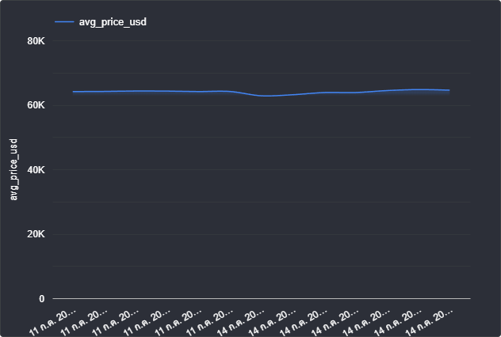

# 🚀 Bitcoin Real-Time ELT Data Pipeline

โปรเจคสร้างสถาปัตยกรรมข้อมูล (Data Architecture) แบบ End-to-End เพื่อดึงข้อมูลราคา Bitcoin แบบ Real-time จัดเก็บลงบน Cloud Data Warehouse พร้อมทำ Data Transformation และแสดงผลผ่าน Dashboard แบบอัตโนมัติ

<!--  -->


---

## 🏗️ System Architecture

ระบบนี้ทำงานอัตโนมัติในรูปแบบ **Extract, Load, Transform (ELT)** ผ่านการควบคุมด้วย Apache Airflow บน Docker Environment:

1. **Orchestration (Airflow):** ใช้ Apache Airflow กำหนด DAG ให้ท่อข้อมูลทำงานอัตโนมัติทุกๆ 5 นาที
2. **Extract (Python):** ดึงข้อมูลราคา Bitcoin ปัจจุบัน (USD, THB) จาก CoinGecko API 
3. **Load (BigQuery):** ใช้ Google Cloud SDK นำข้อมูลดิบ (Raw Data) ขึ้นไปบันทึกบน Google BigQuery แบบ Streaming Ingestion
4. **Transform (SQL):** ให้ Airflow ส่งคำสั่ง SQL ไปรันบน BigQuery เพื่อยุบรวมข้อมูล (Data Aggregation) หาค่าเฉลี่ย ราคาสูงสุด-ต่ำสุด เป็นรายชั่วโมง และบันทึกลงตาราง Data Mart (`hourly_bitcoin_summary`)
5. **Visualize (Looker Studio):** เชื่อมต่อตารางที่ผ่านการ Transform แล้ว นำมาวาดกราฟเส้น

---

## 🛠️ Tech Stack & Tools
* **Containerization:** Docker & Docker Compose
* **Orchestration:** Apache Airflow
* **Language:** Python 3.9, SQL
* **Cloud Platform:** Google Cloud Platform (GCP)
* **Data Warehouse:** Google BigQuery
* **Visualization:** Looker Studio

---


## 🚀 How to Setup & Run

### 1. Prerequisites
* ติดตั้ง **Docker Desktop** เรียบร้อยแล้ว
* มีโปรเจคบน Google Cloud และสร้าง Dataset บน BigQuery ชื่อ `crypto_dataset`

### 2. Google Cloud Key Setup
ดาวน์โหลดไฟล์ Service Account Key (JSON) จาก GCP Console มาวางไว้ที่ root ของโฟลเดอร์โปรเจค และตั้งชื่อว่า `gcp-key.json`

### 3. Start the Environment
เปิด Terminal ในโฟลเดอร์โปรเจคและรันคำสั่งเพื่อสร้างสถาปัตยกรรมระบบ:
```bash
docker compose up -d